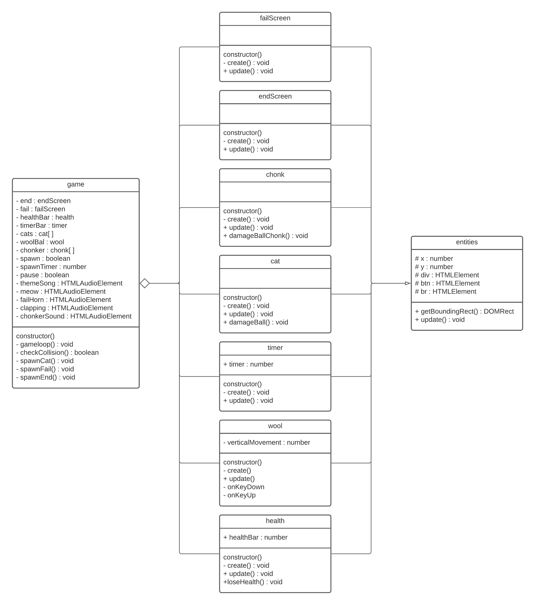

# PRG04 HERKANSING eindopdracht 

Wanneer je volledige eindcijfer (klassendiagram + afgeronde eindopdracht) een onvoldoende is kan je het hele project herkansen. 

- [Kies een nieuwe startopdracht met uniek thema en game mechanic in de gaminator](https://hr-cmgt.github.io/gaminator/) 
- Bedenk hiermee een nieuw game concept. 
- Maak een **nieuw klassendiagram**. 
- **Bouw je nieuwe game** in Object Oriented Typescript.
- Vul dit inleverdocument helemaal in

## Deadline: 23 augustus

**De deadline voor het inleveren van de game is Maandag 23 augustus om 10:00 (week 0).**

⚠️ Je werk wordt **beoordeeld volgens de cursushandleiding**. Lees dit nog even goed door voordat je je project inlevert.

---

 
 
 

## Classes en verantwoordelijkheden
Wool Escape: 
In het spel ben je een bol wol die probeert te overleven tegen een groot aantal katten. 
Om het spel te winnen moet je een 60 seconden de katten overleven, je faalt echter als je je 100 hp verliest (per kat -20hp). 
Deze tijd en health points worden beiden ook in het spel weergegeven. 
Op het moment dat je wint krijg je een scherm te zien waarbij wordt weergegeven dat je hebt gewonnen en hetzelfde als je verliest alleen met een verlies bericht. 
 
De game heeft 2 verschillende enemies, de 'normale' kat en de chonk. 
de 'normale' kat spawnt bij het starten van het spel 5 keer in en elke 4 seconden is er een 50% kans dat er nog een extra 'normale' kat spawnt. 
de chonk  is een kat die groter is dan de 'normale' kat, loopt 50% langzamer dan de 'normale' kat en wordt 2 keer ingespawned aan het begin van het spel.

# Klassendiagram

## Encapsulation

**game**  
Alle Variabelen in de game-class staan op private, omdat deze variabelen niet in andere classes aangepast hoeven te worden. Hetzelfde gelt voor alle functies in de game-class

**failScreen**  
De failscreen-class bestaan alleen uit functies, de create() functie staat op private, omdat deze alleen in de class zelf wordt aangeroepen bij het aanmaken van de class. De update() staat op public, zodat deze functie aangeroepen kan worden in de gameloop in de game-class zodat de update functie ook daadwerkelijk update.

**endScreen**  
De endscreen-class is in het klassendiagram hetzelfde als de failscreen class, en staat dus de create() functie  op private, omdat deze alleen in de class zelf wordt aangeroepen bij het aanmaken van de class. De update() staat op public, zodat deze functie aangeroepen kan worden in de gameloop in de game-class zodat de update functie ook daadwerkelijk update.

**chonk**  
De chonk-class bestaat alleen uit functies, de create() functie staat op private, omdat deze alleen in de class zelf wordt aangeroepen bij het aanmaken van de class. De update() staat op public, zodat deze functie aangeroepen kan worden in de gameloop in de game-class zodat de update functie ook daadwerkelijk update. De damageBallChonk() wordt gebruikt om de chonk weer terug te plaatsen naar de rechterkant na een collsion met de speler. aangezien de collision check plaatsvindt in de game-class staat damagBallChonk() op public.

**cat**  
De cat-class bestaat alleen uit functies, de create() functie staat op private, omdat deze alleen in de class zelf wordt aangeroepen bij het aanmaken van de class. De update() staat op public, zodat deze functie aangeroepen kan worden in de gameloop in de game-class zodat de update functie ook daadwerkelijk update. De damageBall() wordt gebruikt om de cat weer terug te plaatsen naar de rechterkant na een collsion met de speler. aangezien de collision check plaatsvindt in de game-class staat damagBall() op public.

**timer**  
De timer-class heeft 1 variable en de standaard functies. De variabele timer heeft de waarde van de huidige tijd in zich opgeslagen. Deze variabele wordt in de game-class gebruikt om te checken of de tijd 0 is en het eindscherm moet worden weergegeven, daarom staat deze variabele op public. 
de create() functie staat op private, omdat deze alleen in de class zelf wordt aangeroepen bij het aanmaken van de class. De update() staat op public, zodat deze functie aangeroepen kan worden in de gameloop in de game-class zodat de update functie ook daadwerkelijk update.

**wool**  
De wool-class heeft 1 variabele en een aantal functies. de variabele verticalMovement wordt gebruikt om de y aan te passen op het moment dat er op de juiste toetsen wordt gedrukt, dit wordt in de class zelf gedaan en daarom staat de verticalMovement variable op private. De create() functie staat op private, omdat deze alleen in de class zelf wordt aangeroepen bij het aanmaken van de class. De update() staat op public, zodat deze functie aangeroepen kan worden in de gameloop in de game-class zodat de update functie ook daadwerkelijk update. De onKeyDown() functie wordt gebruikt om op het moment dat het pijltje omhoog of omlaag wordt losgelaten ervoor te zorgen dat de bol wol stopt met omhoog of omlaag gaan, dit gebeurt alleen in de wool-class en dus staat onKeyDown() op private. De onKeyUp() functie wordt gebruikt om op het moment dat het pijltje omhoog of omlaag wordt ingedrukt ervoor te zorgen dat de bol wol omhoog of omlaag gaat, dit gebeurt alleen in de wool-class en dus staat onKeyUp() op private. 

**health**  
De health-class heeft 1 variable en de standaard functies. De variabele healthBar heeft de waarde van de huidige health in zich opgeslagen. Deze variabele wordt in de game-class gebruikt om te checken of de health op 0 is en het faalscherm moet worden weergegeven, daarom staat deze variabele op public. 
de create() functie staat op private, omdat deze alleen in de class zelf wordt aangeroepen bij het aanmaken van de class. De update() staat op public, zodat deze functie aangeroepen kan worden in de gameloop in de game-class zodat de update functie ook daadwerkelijk update. de loseHealth() functie wordt gebruikt om van de healthBar elke keer bij een collision 20 punten health eraf te halen. aangezien de collision in de game-class wordt gedaan moet de loseHealth() functie op public staan. 

**entities**  
De entities-class bezit de varibelen x, y, div, btn en br. Deze variabelen worden door alle classes gebruikt behalve door game. om deze variabelen bruikbaar te maken voor alle classen maar niet voor game zijn ze protected gemaakt waardoor ze niet per ongeluk in game kunnen worden aangepast. De functie getBoundingRect() is de functie die gebruikt wordt om collsion te kunnen detecteren, aangezien deze functie in game wordt gebruikt staat hij op public. De update() staat op public, zodat deze functie aangeroepen kan worden in de gameloop in de game-class zodat de update functie ook daadwerkelijk update.

## Composition
game heeft wool, dit is de wollen bal die de speler bestuurt. 
wool is een entities. 
game heeft cat, dit is de kleine kat die de speler moet ontwijken. 
cat is een entities. 
game heeft chonk, dit is de grote langzame kat die de speler moet ontwijken. 
chonk is een entities. 
game heeft timer, dit is de timer die weergeeft hoeveel tijd er is verstreken. 
timer is een entities. 
game heeft health, dit de health die weergeeft hoeveel health er over is. 
health is een entities. 
game heeft endScreen, dit is het scherm dat wordt weergegeven wanneer de tijd is verstreken. 
endscreen is een entities. 
game heeft failScreen, dit is het scherm dat wordt weergegeven wanneer de speler geen health meer heeft. 
failscreen is een entities. 

## Inheritance
Overerving is toegepast op failScreen, endScreen, chonk, cat, timer, wool en health. de parent van al deze classes is entitites en deze heeft meerdere variabelen en een functie.  
**variabelen** 
x en y zijn twee number variabelen die verantwoordelijk zijn voor de locatie van de classes op het scherm. aangezien alle classes uiteindelijk op het scherm te zien zijn, worden deze variabelen bij alle children toegepast.
  
div, btn, br zijn alle 3 HTMLElement variabelen, maar hebben wel verschillende taken. De div variabel wordt gebruikt voor het maken van het element waarin de bijhorende class in wordt geplaats, dit wordt bij alle classes gebruikt en div wordt dus bij alle children ingezet. btn en br worden bij de children endScreen en failscreen gebruikt. btn wordt gebruikt om de btn weer te geven die de game opnieuw start en br wordt gebruikt om de button en de tekst van div (toegevoegd doormiddel van .innerHTML, hier was dus geen extra variabel voor nodig) van elkaar te scheiden wat er beter uitziet in de game.
 
 

**functie** 
de functie die wordt overgeërfd is de de update() functie. in deze functie wordt de nummer waarde van de x en de y variabelen omgezet in px, die in tegenstelling tot de number van x en y wel te gebruiken is voor styling.  
 
 
 

# Game

Mijn nieuwe thema uit de [gaminator](https://hr-cmgt.github.io/gaminator/) is: Challenge, Escape en katten  
Wool Escape: 
In het spel ben je een bol wol die probeert te overleven tegen een groot aantal katten. 
Om het spel te winnen moet je een 60 seconden de katten overleven, je faalt echter als je je 100 hp verliest (per kat -20hp). 
Deze tijd en health points worden beiden ook in het spel weergegeven. 
Op het moment dat je wint krijg je een scherm te zien waarbij wordt weergegeven dat je hebt gewonnen en hetzelfde als je verliest alleen met een verlies bericht. 
 
De game heeft 2 verschillende enemies, de 'normale' kat en de chonk. 
de 'normale' kat spawnt bij het starten van het spel 5 keer in en elke 4 seconden is er een 50% kans dat er nog een extra 'normale' kat spawnt. 
de chonk  is een kat die groter is dan de 'normale' kat, loopt 50% langzamer dan de 'normale' kat en wordt 2 keer ingespawned aan het begin van het spel.

## Classes

Toelichting classes

## Encapsulation

Toelichting encapsulation

## Composition

Toelichting composition

## Inheritance

Toelichting inheritance

## Game development technieken

Beschrijving game development technieken
